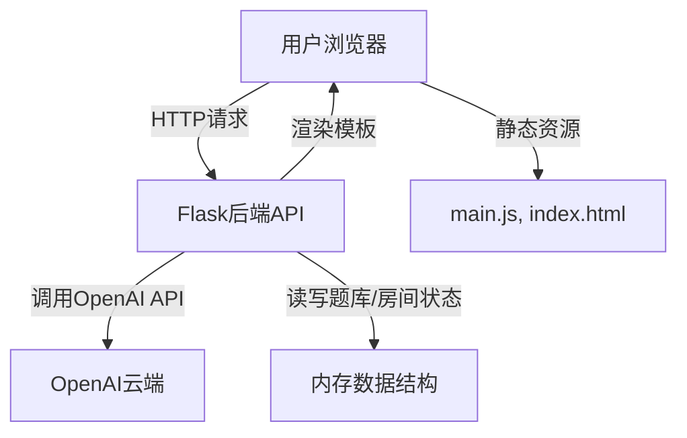

<!--more-->

# AI海龟汤聊天室：开源多人推理游戏的AI智能化实践与源码深度解析

> 项目地址：[https://github.com/mumuhaha487/Turtle_Soup](https://github.com/mumuhaha487/Turtle_Soup)  
> B站演示视频：[https://www.bilibili.com/video/BV1LEuAzgEdr](https://www.bilibili.com/video/BV1LEuAzgEdr)

---

## 一、项目背景与初衷

### 1.1 海龟汤游戏简介

“海龟汤”是一种风靡于推理爱好者中的烧脑游戏。游戏流程通常由一名出题者给出一个不完整的“汤面”（即谜题），其他玩家通过不断提问，试图还原事件的全貌，最终拼凑出“汤底”（即答案）。出题者只能用“是”“不是”“不重要”来回答问题，极大考验玩家的想象力和推理能力。

### 1.2 为什么要做AI海龟汤聊天室？

传统的海龟汤游戏需要一名主持人全程参与，既要掌控节奏，又要回答问题，容易疲劳且不易组织。随着AI技术的发展，能否让AI来担任主持人角色？能否让推理游戏变得更智能、更有趣、更易于线上组织？带着这些问题，我开发了**AI海龟汤聊天室**项目。

---

## 二、项目核心思想与技术选型

### 2.1 核心思想

- **AI赋能传统游戏**：用AI大模型（如OpenAI GPT系列）替代人工主持，实现自动化、智能化的推理游戏体验。
- **多人实时互动**：支持房间系统，玩家可自由创建/加入房间，实时互动，提升社交属性。
- **题库自定义与扩展**：支持房主上传自定义题库，满足不同场景和难度需求。
- **极简部署与开源**：一键部署，开箱即用，代码完全开源，便于二次开发和学习。

### 2.2 技术选型

- **后端**：Flask（轻量级Web框架，易于快速开发API）
- **前端**：原生HTML+CSS+JavaScript（无需构建工具，易于维护和二次开发）
- **AI接口**：OpenAI API（支持多种大模型，灵活可扩展）
- **实时通信**：基于HTTP轮询（兼容性好，部署简单）
- **配置管理**：dotenv（支持通过.env文件灵活配置AI提示词等参数）

---

## 三、系统架构与模块设计

### 3.1 总体架构图



### 3.2 主要模块

- **房间管理模块**：负责房间的创建、加入、成员管理、房主权限等。
- **AI主持人模块**：负责与OpenAI API交互，生成AI回复，支持自定义提示词。
- **题库管理模块**：支持题目上传、切换、展示、答案揭晓等功能。
- **聊天与消息模块**：支持AI对话和无AI群聊，消息轮询与历史记录。
- **前端交互模块**：负责页面切换、表单提交、消息渲染、用户列表等。

---

## 四、核心功能与实现细节

### 4.1 房间系统

#### 4.1.1 房间创建与加入

每个房间有唯一的邀请码，房主创建房间时需填写昵称、OpenAI API Key、模型名等信息。其他玩家通过邀请码加入房间，昵称唯一。

**核心代码片段：**

```python
@app.route('/api/create_room', methods=['POST'])
def create_room():
    data = request.json
    nickname = data.get('nickname')
    base_url = data.get('base_url')
    api_key = data.get('api_key')
    model = data.get('model')
    if not (nickname and base_url and api_key and model):
        return jsonify({'error': '参数不完整'}), 400
    code = gen_code()
    with rooms_lock:
        while code in rooms:
            code = gen_code()
        rooms[code] = {
            'owner': nickname,
            'base_url': base_url,
            'api_key': api_key,
            'model': model,
            'messages': [],
            'members': {nickname: {'nickname': nickname}}
        }
    session['nickname'] = nickname
    session['room_code'] = code
    return jsonify({'code': code})
```

#### 4.1.2 房间状态与并发安全

所有房间信息存储于内存字典`rooms`，通过`threading.Lock`保证并发安全。每个房间包含房主、成员、题库、消息等信息。

---

### 4.2 AI主持人机制

#### 4.2.1 AI提示词预设（Preset）

AI主持人的行为高度依赖于系统提示词（system prompt）。本项目支持通过`.env`文件自定义`preset`，实现灵活的AI主持风格。

**核心代码片段：**

```python
from dotenv import load_dotenv
import os

load_dotenv()
PRESET = os.getenv('preset', None)

# 在AI回复时优先使用preset
if PRESET and PRESET.strip():
    preset = PRESET
else:
    preset = f"你现在是海龟汤推理游戏的主持人。当前题目如下：\\n\\n汤面：{story.get('surface', '')}\\n\\n游戏规则：出题者先给出不完整的'汤面'（题目），让猜题者提出各种可能性的问题，而出题者只能回答'是'、'不是'或'不重要'；如果只是一部分对的但是另外一部分不对造成回答对于不对都不准确，就回答'是也不是'。猜题者在有限的线索中推理出事件的始末，拼出故事的全貌，凑出一个'汤底'（答案）。你只需根据规则回答问题，不要直接给出答案。同时会给出胜利条件，由你来决定是否过关。\\n\\n补充说明（仅供AI参考）：{additional}\\n\\n胜利条件：{victory_condition}"
```

#### 4.2.2 AI消息生成流程

每次玩家提问，后端会整理历史消息，构造对话上下文，调用OpenAI API生成AI回复，并将回复加入消息历史。

**核心代码片段：**

```python
client = OpenAI(base_url=room['base_url'], api_key=room['api_key'])
completion = client.chat.completions.create(
    model=room['model'],
    messages=messages
)
reply = completion.choices[0].message.content
room['messages'].append({'role': 'assistant', 'content': reply, 'nickname': 'AI'})
```

---

### 4.3 题库管理与扩展

#### 4.3.1 题目上传与解析

房主可上传单题或批量题库（JSON格式），后端自动解析并存储于房间对象中。

**核心代码片段：**

```python
@app.route('/api/upload_story', methods=['POST'])
def upload_story():
    code = request.form.get('code')
    nickname = request.form.get('nickname')
    with rooms_lock:
        room = rooms.get(code)
        if room['owner'] != nickname:
            return jsonify({'error': '只有房主可以上传题目'}), 403
        if 'stories' not in room:
            room['stories'] = []
        files = request.files.getlist('file')
        for file in files:
            try:
                story = json.load(file)
                if isinstance(story, list):
                    room['stories'].extend(story)
                else:
                    room['stories'].append(story)
            except Exception as e:
                return jsonify({'error': f'文件解析失败: {str(e)}'}), 400
```

#### 4.3.2 题目切换与答案揭晓

房主可切换当前题目，适时揭晓答案，AI主持人会根据题目内容调整回复。

---

### 4.4 聊天与消息系统

#### 4.4.1 AI对话与无AI群聊

项目支持两种聊天模式：
- **AI对话**：玩家与AI主持人互动，进行推理问答。
- **无AI群聊**：玩家之间自由交流，支持@用户名高亮。

#### 4.4.2 消息轮询与实时性

前端通过定时轮询API获取最新消息和在线用户列表，保证消息的实时性和同步。

**核心代码片段（前端JS）：**

```javascript
function pollMessages() {
    if (!roomCode) return;
    fetch('/api/get_messages', {
        method: 'POST',
        headers: {'Content-Type': 'application/json'},
        body: JSON.stringify({code: roomCode})
    })
    .then(res => res.json())
    .then(data => {
        if (data.messages) {
            renderMessages(data.messages);
        }
    });
}
setInterval(pollMessages, 2000);
```

---

### 4.5 用户与权限管理

- 房主拥有上传题目、切换题目、揭晓答案、删除房间等权限。
- 普通成员只能参与推理和群聊，不能管理题库和房间。

---

## 五、前后端交互流程详解

### 5.1 页面结构与路由

前端采用单页应用结构，通过JS控制页面切换（首页、创建房间、加入房间、群聊页）。所有数据交互均通过AJAX与后端API通信。

### 5.2 主要API接口说明

| 接口路径                | 方法 | 说明                   |
|------------------------|------|------------------------|
| `/api/create_room`     | POST | 创建房间               |
| `/api/join_room`       | POST | 加入房间               |
| `/api/send_message`    | POST | 发送AI推理消息         |
| `/api/send_chat_message`| POST | 发送无AI群聊消息       |
| `/api/get_messages`    | POST | 获取AI推理消息历史     |
| `/api/get_chat_messages`| POST | 获取群聊消息历史       |
| `/api/upload_story`    | POST | 上传题库               |
| `/api/set_story`       | POST | 切换当前题目           |
| `/api/reveal_answer`   | POST | 揭晓答案               |
| `/api/get_online_users`| POST | 获取在线用户列表       |
| `/api/delete_room`     | POST | 删除房间（房主权限）   |

---

## 六、AI提示词机制与自定义

### 6.1 为什么要自定义AI提示词？

AI大模型的行为很大程度上受system prompt影响。通过自定义preset，可以让AI主持人风格更贴合实际需求，比如更幽默、更严谨、更鼓励玩家提问等。

### 6.2 .env文件配置

在项目根目录下新建`.env`文件：

```env
preset=你现在是最强AI推理主持人，请严格按照海龟汤规则回答问题，绝不剧透答案，鼓励玩家多提问，气氛活跃！
```

后端会自动读取并应用该preset，无需重启服务即可生效。

---

## 七、题库扩展与自定义

### 7.1 题库格式

支持单题和批量上传，格式如下：

```json
{
  "surface": "一个人走进餐厅，点了一份海龟汤，尝了一口后自杀了。为什么？",
  "answer": "这个人以前在海上遇难，同伴为了生存而牺牲，他喝的海龟汤正是用同伴的肉做的。",
  "victory_condition": "猜出这个人自杀的原因",
  "additional": "这个人有特殊的经历背景"
}
```

批量上传：

```json
[
  {
    "surface": "题目1",
    "answer": "答案1",
    "victory_condition": "胜利条件1"
  },
  {
    "surface": "题目2",
    "answer": "答案2",
    "victory_condition": "胜利条件2"
  }
]
```

### 7.2 题库管理建议

- 题目要有趣且有一定难度，避免过于简单或无解。
- 可根据场景自定义题库，如“科幻主题”“历史主题”等。
- 支持社区共建，欢迎大家PR题库！

---

## 八、部署与优化建议

### 8.1 本地部署

1. 克隆项目并安装依赖
2. 配置.env（可选）
3. 启动服务，浏览器访问`http://localhost:5000`

### 8.2 生产环境部署建议

- 使用`gunicorn`+`nginx`部署后端，提升并发能力
- 前端可用CDN加速静态资源
- 可接入Redis等持久化存储，避免内存丢失
- 定期备份题库和房间数据

### 8.3 性能优化

- 消息轮询可升级为WebSocket，提升实时性和效率
- AI回复可做缓存，减少重复请求
- 支持多房间并发，提升大规模活动承载能力

---

## 九、项目源码结构与解读

### 9.1 目录结构

```
haiguitang/
├── app.py              # Flask主应用
├── requirements.txt    # Python依赖
├── static/
│   └── main.js        # 前端JavaScript
└── templates/
    └── index.html     # 主页面模板
```

### 9.2 关键文件讲解

#### app.py

- Flask主程序，包含所有API路由和业务逻辑
- 房间、题库、消息、AI交互等核心功能均在此实现

#### static/main.js

- 前端核心交互逻辑
- 页面切换、表单提交、消息渲染、用户列表、轮询机制等

#### templates/index.html

- 主页面模板，现代化UI设计
- 响应式布局，兼容PC和移动端

---

## 十、未来展望与社区共建

### 10.1 功能规划

- 支持WebSocket实时通信
- 题库在线编辑与管理
- AI主持人多风格切换
- 题目难度分级与排行榜
- 移动端App适配

### 10.2 社区共建

欢迎大家Star、Fork、提Issue、PR题库或新功能！  
也欢迎在B站视频下留言交流体验和建议。

---

## 十一、结语

AI海龟汤聊天室是一次AI与传统推理游戏的创新融合。它不仅让推理游戏更智能、更有趣，也为AI在娱乐、社交领域的应用提供了新思路。希望这份开源项目和详细源码解析能帮助到你，也欢迎你加入共建，让AI推理游戏更精彩！

> 项目地址：[https://github.com/mumuhaha487/Turtle_Soup](https://github.com/mumuhaha487/Turtle_Soup)  
> B站演示视频：[https://www.bilibili.com/video/BV1LEuAzgEdr](https://www.bilibili.com/video/BV1LEuAzgEdr)

---

**快叫上小伙伴，一起体验AI推理的乐趣吧！🐢**
